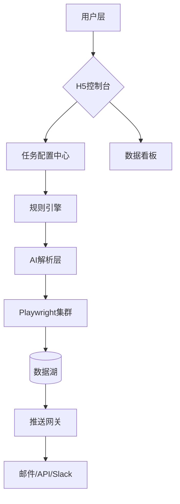
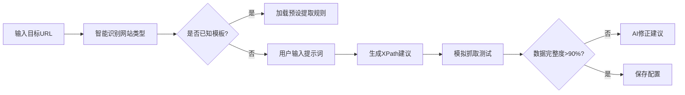

以下是基于讨论内容整理的完整PRD文档框架，采用结构化叙事方式呈现核心要素。您可根据实际需求调整细节：

# 信息雷达 PRD  
**版本**：1.0 Beta  
**最后更新**：2025年2月27日

---

## 一、产品概述
### 1.1 核心价值主张
```markdown
- **一句话定义**：面向行业研究者的可编程监控工具，通过AI增强的精准抓取+结构化处理，实现「像训练专属情报员一样」的领域动态追踪  
- **价值公式**：  
  （监控目标数 × 信息维度） / （配置时间 + 噪音干扰） = 传统方案效率 ×5倍
```

### 1.2 目标用户画像
#### 核心用户（优先级排序）
| 用户类型         | 使用场景                  | 关键行为特征                     | 付费敏感度 |
|------------------|---------------------------|----------------------------------|------------|
| 行业分析师       | 竞品技术动态追踪          | 日均监控10+企业官网/垂直媒体     | $$$        |
| 投资分析师       | 赛道标的筛查              | 要求投融资事件工商数据关联       | $$         |
| 市场情报经理     | 政策法规预警              | 需API接入内部BI系统              | $$$$       |

#### 次级用户（观察区）
- **学术研究者**：论文趋势跟踪（2024 Q2后评估需求）
- **自媒体运营者**：热点事件抓取（需验证内容版权风险）

### 1.3 竞品差异矩阵
| 维度/产品       | 本产品                | Google Alerts       | Meltwater           | 自建采集            |
|-----------------|-----------------------|---------------------|---------------------|---------------------|
| 规则灵活性      | 🔵自然语言配置        | 🔴固定关键词         | 🟡预设行业包         | 🟢代码级自由        |
| 数据结构化      | 🔵AI动态提取字段      | 🟠纯文本推送         | 🔵有限字段           | 🟠依赖开发          |
| 部署成本        | 🟡$29/月起            | 🟢免费               | 🔴$500+/月           | 🔴人力+服务器       |
| 反爬绕过能力    | 🔵动态IP+行为模拟     | 🟢N/A               | 🟡企业级代理         | 🔴高维护成本        |

---

## 二、产品架构
### 2.1 系统架构图


### 2.2 关键技术栈
| 模块           | 技术方案                           | 备注                              |
|----------------|------------------------------------|-----------------------------------|
| 采集执行       | Playwright + 分布式浏览器集群      | 支持SSR/SPA网站                  |
| 反爬对抗       | IP轮换服务 + 鼠标轨迹模拟库        | 合作IP供应商：BrightData        |
| AI解析         | GPT-4微调模型 + 领域实体识别        | 医疗/芯片领域专用NER模型         |
| 任务调度       | Celery + Redis                     | 支持10万级并发任务               |

---

## 三、核心功能详述
### 3.1 智能监控配置系统
#### 功能流程图


#### 关键交互设计
- **动态引导**：当用户输入`crunchbase.com`时，自动推荐「投融资事件模板」  
- **风险管控**：抓取频率超过2次/小时时强制添加验证码破解服务（+$0.01/次）  
- **智能纠错**：当网站改版导致元素丢失时，基于历史数据预测新选择器（需用户确认）

### 3.2 分级推送机制
| 推送级别   | 触发条件                    | 通知方式          | 示例场景                  |
|------------|-----------------------------|-------------------|---------------------------|
| 实时       | 关键词组合突发高频出现      | 短信+邮件         | 政策文件提及"牌照暂停"    |
| 每日摘要   | 常规抓取结果                | 邮件+PDF附件      | 竞品技术更新汇总          |
| 周期报告   | 用户预设时间（如每周一）    | 邮件+可视化看板   | 赛道融资趋势周报          |

---

## 四、商业化计划
### 4.1 定价模型
#### 版本对比矩阵
| 功能/版本       | 免费版                | 专业版（$29/月）      | 企业版（$999/月）       |
|-----------------|-----------------------|-----------------------|-------------------------|
| 监控任务数      | 3个                   | 15个                  | 无限                    |
| 数据维度        | 基础字段              | +工商数据关联         | +专利/招投标数据        |
| 推送时效        | 延迟6小时             | 实时                  | 实时+自定义工作流       |
| SLA保障         | 无                    | 99%可用性             | 99.9%可用性+专属客服    |

#### 盈利预测
```markdown
- **假设**：  
  - 月新增用户：200（免费版转化率15% → 30付费用户）  
  - 企业客户：2家/月（平均客单价$1500）  
- **月收入**：  
  （30×29）+（2×1500） = $870 + $3000 = **$3870**
```

### 4.2 冷启动执行计划
#### 阶段目标
| 时间节点   | 里程碑                  | 关键指标                   |
|------------|-------------------------|----------------------------|
| 第1个月    | 种子用户获取            | 200注册用户（50%激活率）   |
| 第2个月    | MVP验证闭环             | 付费转化率>8%              |
| 第3个月    | 模板市场上线            | UGC模板数>50               |

#### 场景模板库（首批）
| 模板名称       | 预配置规则示例                          | 目标用户群         |
|----------------|----------------------------------------|--------------------|
| 医疗投资雷达   | 抓取8家医疗媒体，提取B轮后融资事件      | VC机构分析师       |
| 芯片人才流动   | 监控20家企业招聘页，识别资深工程师离职  | 猎头公司           |
| 政策风向标     | 捕获各省工信厅公示文件，标记"补贴"条款  | 企业政府事务部     |

---

## 五、法律与合规
### 5.1 风险管控措施
- **用户协议重点条款**：  
  ▸ 用户需承诺仅抓取公开可用数据  
  ▸ 禁止用于爬取个人隐私/著作权内容  
  ▸ 平台有权终止高风险任务（如触发法律诉讼）  
- **数据安全**：  
  ▸ 欧盟GDPR合规（所有邮件含退订链接）  
  ▸ 加密存储用户配置的API密钥  

---

## 六、附录
### 6.1 术语表
| 术语         | 定义                               |
|--------------|------------------------------------|
| NER模型      | 用于识别文本中特定实体的AI模型      |
| 行为模拟     | 模仿人类浏览模式绕过反爬机制的技术   |

