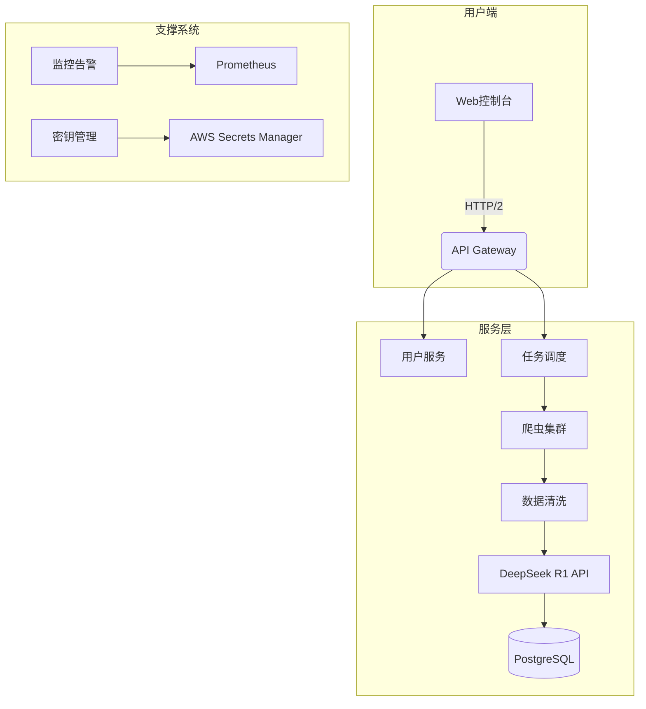
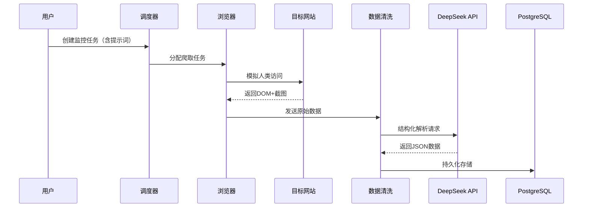
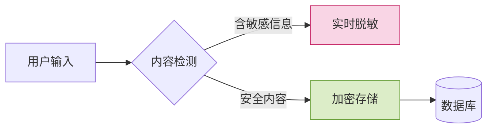

# 智能领域监控系统技术产品文档  
**版本**：1.0  

---

## 一、产品概述
### 1.1 产品定位
```markdown
- **核心价值**：通过AI增强的精准信息采集+结构化处理，帮助从业者用1/5时间完成领域动态监控  
- **技术亮点**：  
  ▸ 基于DeepSeek R1的自然语言指令解析  
  ▸ 动态适配的智能爬虫引擎  
  ▸ 企业级数据安全合规方案
```

### 1.2 目标用户
| 用户类型         | 典型场景                  | 价值感知点              | 优先级 |
|------------------|---------------------------|-------------------------|--------|
| 行业分析师       | 竞品技术动态追踪          | 结构化数据导出          | P0     |
| 投资经理         | 赛道标的筛查              | 工商数据关联            | P1     |
| 学术研究者       | 论文趋势跟踪（未来扩展）  | 文献关联分析            | P2     |

### 1.3 核心指标
```math
用户价值公式 = \frac{监控目标数 × 信息维度}{(配置时间 + 人工复核时间)} 
目标：达到传统方案（如Google Alerts）的5倍效率
```

---

## 二、技术架构设计
### 2.1 系统架构图


### 2.2 技术栈选型
| 模块            | 技术方案                          | 版本   | 选型理由                     |
|-----------------|-----------------------------------|--------|------------------------------|
| **前端**        | Next.js + TypeScript             | 13.4   | 服务端渲染+组件化            |
| **后端**        | NestJS + TypeGraphQL             | 10.0   | 渐进式框架+强类型约束        |
| **爬虫引擎**    | Playwright + Browserless         | 1.37   | Headless浏览器兼容性         |
| **AI服务**      | DeepSeek R1 API                  | 2023Q3 | 中文领域SOTA模型             |
| **数据存储**    | PostgreSQL (JSONB)               | 15     | 结构化+非结构化混合存储      |
| **基础设施**    | Docker + Docker Compose          | 24.0   | 环境一致性保障               |

---

## 三、核心模块设计
### 3.1 智能爬虫引擎
#### 工作流程


#### 反爬策略
```typescript
// 浏览器指纹伪装
const createStealthContext = async () => {
  const context = await browser.newContext({
    userAgent: generateRandomUA(),
    viewport: { width: 1920, height: 1080 },
    proxy: await getRotatingProxy()
  });
  
  // 覆盖WebGL指纹
  await context.addInitScript(() => {
    const getParameter = WebGLRenderingContext.prototype.getParameter;
    WebGLRenderingContext.prototype.getParameter = function(parameter) {
      if (parameter === 37445) return 'Intel Inc.'; // 伪装GPU厂商
      return getParameter.apply(this, [parameter]);
    };
  });
  
  return context;
};
```

---

## 四、接口规范
### 4.1 任务管理接口
**Endpoint**: `POST /api/v1/tasks`  
**Request**:
```json
{
  "name": "AI芯片融资监控",
  "extract_rules": "提取金额>500万美元的事件，排除天使轮",
  "targets": [
    {
      "url": "https://example.com",
    }
  ],
  "schedule": {
    "frequency": "daily",
    "timezone": "Asia/Shanghai"
  }
}
```

**Response**:
```json
{
  "task_id": "550e8400-e29b-41d4-a716-446655440000",
  "cost_estimate": {
    "api_credits": 12,
    "storage": "5MB/month" 
  }
}
```

### 4.2 健康检查接口
```bash
GET /health
Response:
{
  "status": "healthy",
  "components": {
    "database": {"latency": "32ms"},
    "deepseek_api": {"latency": "189ms"},
    "crawler": {"active_tasks": 42}
  }
}
```

---

## 五、部署方案
### 5.1 容器化配置
```yaml
# docker-compose.prod.yml
version: '3.8'

services:
  web:
    image: registry.example.com/web:v1.0
    deploy:
      replicas: 3
    configs:
      - source: deepseek_api_key
        target: /run/secrets/deepseek-key

  crawler:
    image: registry.example.com/crawler:v1.0
    deploy:
      resources:
        reservations:
          devices:
            - driver: nvidia
              count: 1
              capabilities: [gpu]

configs:
  deepseek_api_key:
    external: true
```

### 5.2 监控指标
| 指标名称                | 类型    | 告警阈值          | 采集方式         |
|-------------------------|---------|-------------------|------------------|
| api_success_rate        | Gauge   | <95% (5min)       | Prometheus       |
| crawler_blocked         | Counter | >10次/小时        | 日志分析         |
| deepseek_cost_daily     | Gauge   | >$50/天           | 自定义导出器     |

---

## 六、安全与合规
### 6.1 数据安全措施


### 6.2 访问控制矩阵
| 角色            | 数据访问权限          | 操作权限                  |
|-----------------|-----------------------|---------------------------|
| 普通用户        | 自有任务数据          | 创建/启停任务             |
| 管理员          | 全平台数据            | 审计日志查看+系统配置     |
| API消费者       | 授权范围内的数据      | 通过OAuth2.0调用API       |

---

## 七、附录
### 7.1 术语表
| 术语          | 解释                          |
|---------------|-------------------------------|
| NER模型       | 命名实体识别模型              |
| MOE架构       | 混合专家神经网络架构          |
| JSONB         | PostgreSQL的二进制JSON存储格式|

